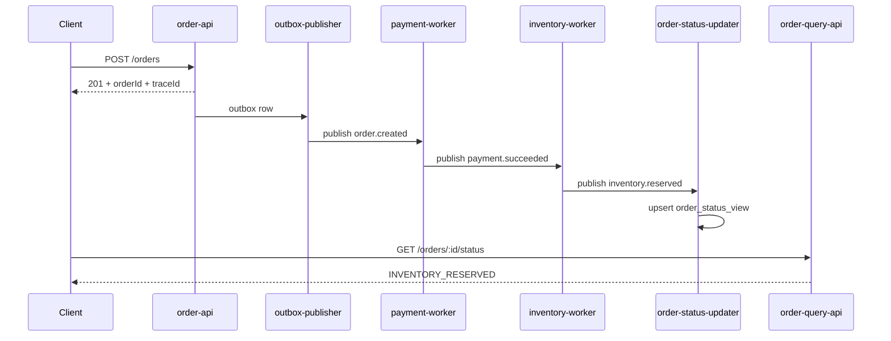
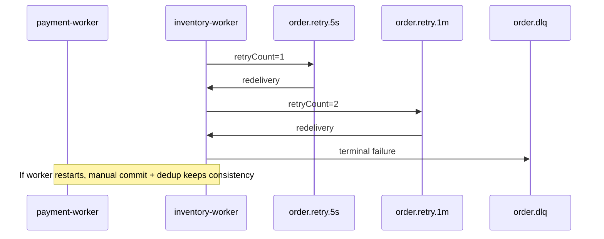

# System Diagrams

## Bounded context and service map

```mermaid
flowchart LR
  OA[order-api]\n(Order BC)
  OB[outbox-publisher]
  PW[payment-worker]\n(Payment BC)
  IW[inventory-worker]\n(Inventory BC)
  SU[order-status-updater]\n(Read Model BC)
  OQ[order-query-api]

  T1[(order.created)]
  T2[(payment.events)]
  T3[(inventory.events)]
  TS[(order.status compacted)]
  TR5[(order.retry.5s)]
  TR1[(order.retry.1m)]
  DLQ[(order.dlq)]

  OA --> OB --> T1
  T1 --> PW --> T2
  T2 --> IW --> T3
  T1 --> SU
  T2 --> SU
  T3 --> SU --> TS --> OQ

  PW -.retry/dlq.-> TR5
  PW -.retry/dlq.-> TR1
  PW -.terminal.-> DLQ
  IW -.retry/dlq.-> TR5
  IW -.retry/dlq.-> TR1
  IW -.terminal.-> DLQ
  SU -.retry/dlq.-> TR5
  SU -.retry/dlq.-> TR1
  SU -.terminal.-> DLQ
```

## Happy path sequence



## Failure and recovery sequence


